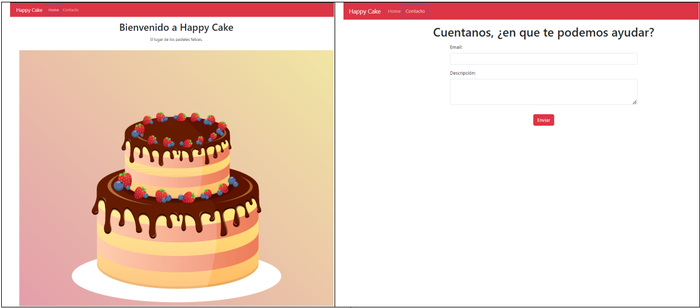

# Módulo 4 REACT II - React Router I - Happy Cake

## Presentación Página Web

##  

 

## Descripción del PY ⌨️

Desarrollé una página web aplicando loos conocimientos adquiridos respecto a React Router. Creando components, views y utilizando links.

## Tecnologías Usadas 🛠️

- **HTML** 💀
- **CSS** 🎆
- **JS** 🧑‍💻
- **REACT JS** 👌
- **React-Bootstrap** 📚
- **React-Router**

 

---

 

## Autor 👨‍💻

**Desarrolladores FullStack G-60 Luis Fernando Sanchez F.⚡**

Sígueme en mis redes sociales: 
 
